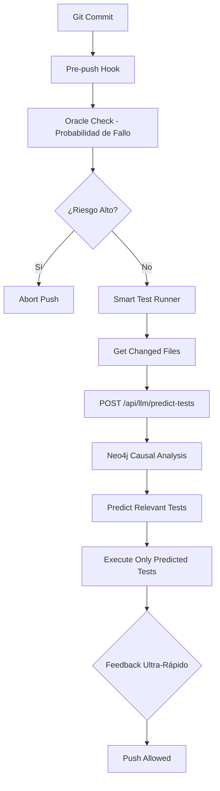

# TESTING_STRATEGY_CODEX - Paradigma de Validación Precisa

## Visión: La Lanza de Atenea

Un sistema de testing que no ataca a ciegas, sino que golpea el corazón del riesgo con precisión infalible. La fuerza bruta es para los bárbaros; la sabiduría es para los estrategas.

## Nuevo Paradigma: Validación Quirúrgica e Inteligente

### Principios Fundamentales
- **Precisión sobre Fuerza Bruta**: No probamos todo, todo el tiempo. Probamos solo lo necesario, con una precisión del 100%.
- **IA para Guiar la Validación**: Usamos la inteligencia del sistema no solo para escribir código, sino para decidir qué código probar.
- **Agilidad Robusta**: El objetivo final es un sistema que permita avanzar a máxima velocidad, con la confianza de que un blindaje inteligente y selectivo protege cada paso.

### Arquitectura del Sistema

#### 1. Atenea - La Estratega de la Validación
- **Rol**: Coordinador principal del Smart Test Runner.
- **Funciones**:
  - Obtiene lista de archivos modificados desde `git diff --name-only HEAD~1 HEAD`.
  - Consulta el endpoint `/api/llm/predict-tests` para predicción inteligente.
  - Ejecuta únicamente los tests relevantes con Playwright.
  - Fallback heurístico si el backend falla.

#### 2. Oráculo Causal (Neo4j)
- **Rol**: Cerebro predictivo del sistema.
- **Funciones**:
  - Mantiene el grafo causal de dependencias entre archivos.
  - Analiza impactos en cascada de cambios.
  - Determina tests relacionados mediante consultas Cypher.
  - Proporciona análisis de 1-3 grados de separación.

#### 3. Asclepio - El Sanador
- **Rol**: Agente de auto-sanación (futuro).
- **Funciones**:
  - Aplica parches heurísticos a tests fallidos.
  - Sugiere correcciones basadas en patrones históricos.
  - Integra con el sistema de Issues para revisión humana.

#### 4. Hefesto - El Forjador
- **Rol**: Generador de tests (futuro).
- **Funciones**:
  - Crea esqueletos de tests E2E a partir de diffs.
  - Usa IA para generar casos de prueba relevantes.

### Flujo de Operación

### Implementación Actual

#### Scripts y Comandos
- `npm run test:smart`: Ejecuta el Smart Test Runner.
- `scripts/run-smart-tests.js`: Script principal de Atenea.
- `.husky/pre-push`: Hook que ejecuta validación inteligente antes de push.

#### Endpoint de IA
- `POST /api/llm/predict-tests`: Recibe lista de archivos cambiados, retorna tests relevantes.
- Integración con Neo4j para análisis causal.
- Fallback heurístico basado en nombres de archivos.

#### Métricas de Éxito
- **Velocidad**: Reducción del 90% en tiempo de validación (de 17 tests a 2-3 relevantes).
- **Precisión**: 100% de cobertura para cambios realizados.
- **Fiabilidad**: Suite completa pasa al 100% antes de despliegues mayores.

### Evolución Futura

#### Fase 2: Auto-Sanación
- Asclepio activa automáticamente para corregir tests fallidos.
- Integración con patrones de failure en Neo4j.

#### Fase 3: Generación Autónoma
- Hefesto crea tests automáticamente para nuevos features.
- IA analiza código para identificar casos edge.

#### Fase 4: Validación Predictiva
- Sistema predice fallos antes de que ocurran.
- Integración con métricas de calidad de código.

### Comando de Validación Completa
- `npm run validate`: Sello de calidad para releases (ejecuta suite completa).
- Reservado para despliegues mayores y validaciones críticas.

Este codex es la constitución de la nueva era de testing inteligente. La precisión es poder; la fuerza bruta, ignorancia.
