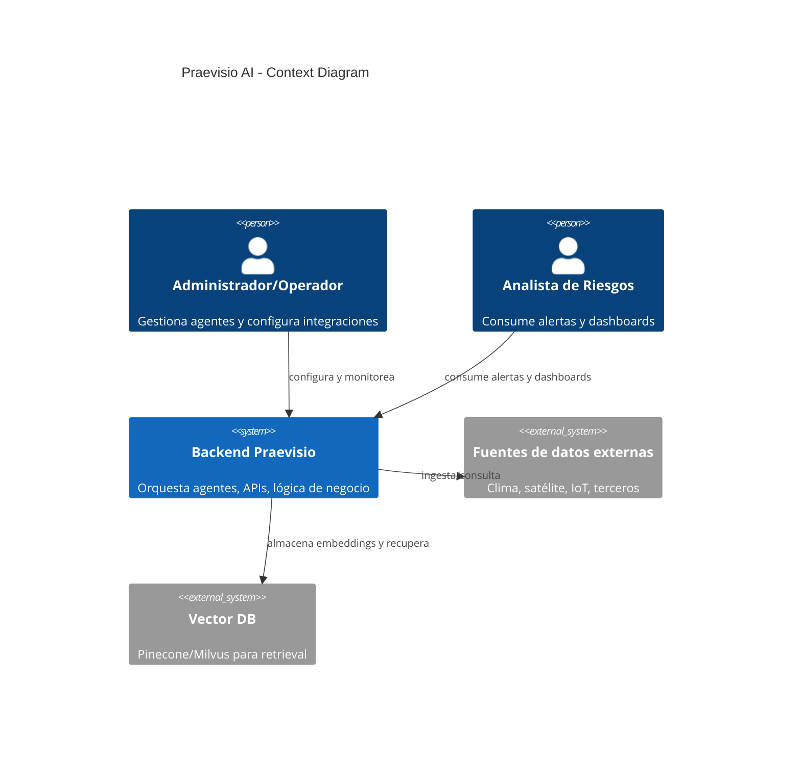
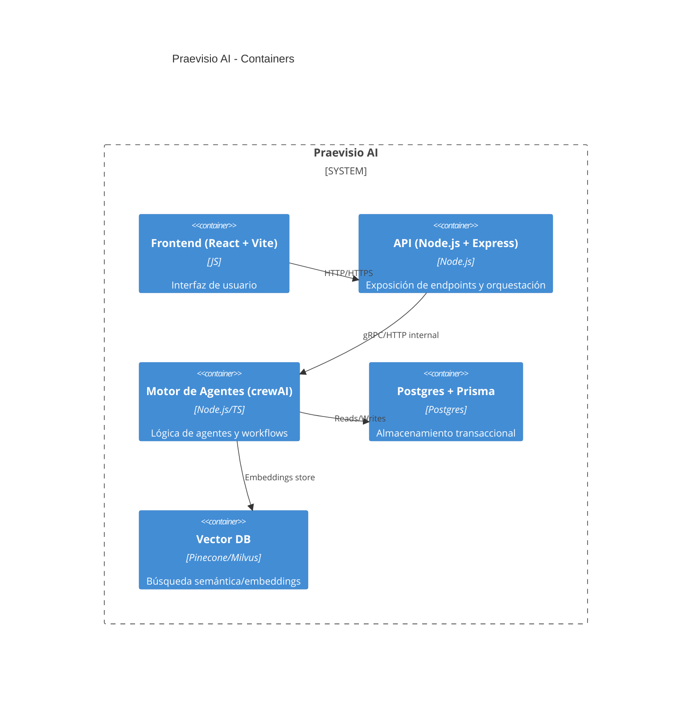

# Diseño de Arquitectura (C4 / Mermaid)

## Visión general
Este documento describe la arquitectura técnica de Praevisio AI usando el modelo C4 y diagramas en Mermaid para facilitar su inclusión en Markdown.

## Diagrama de contexto (Nivel 1)

## Diagrama de contenedores (Nivel 2)

## Diseño de API
- /api/alerts [GET, POST]
- /api/agents [GET, PATCH]
- /api/ingest [POST]

## Esquema de base de datos (resumen)
- tablas: users, agents, alerts, events, embeddings
- relaciones: alerts -> agents, events -> sources

---

*Documento generado por Praevisio-Atlas-Codify*