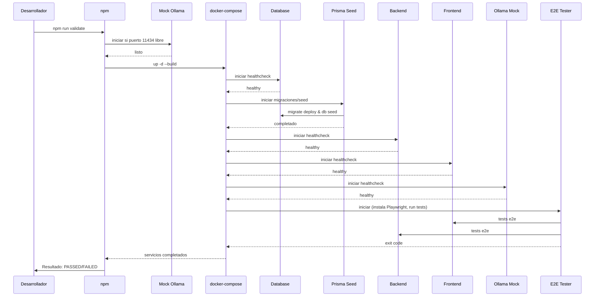

# Flujo de Validación Local

Este documento muestra el flujo paso a paso que ocurre cuando un desarrollador ejecuta `npm run validate` en el entorno local. Incluye un diagrama de secuencia en Mermaid para entender dependencias y tiempos de espera.

## Resumen rápido
`npm run validate` ejecuta `validate_local.sh`: inicia mock Ollama si puerto 11434 libre, ejecuta `docker-compose up -d --build` (levanta db, backend, prisma-seed, frontend, ollama-mock, e2e-tester), espera healthchecks con `wait-for-services.sh`, espera que e2e-tester termine y verifica exit code. Incluye linters, compilación TypeScript, tests unitarios y E2E (Playwright). Si alguna etapa falla, el flujo se detiene y devuelve error.

## Diagrama de Secuencia (Mermaid)

## Recomendaciones
- Healthchecks configurados con interval: 5-10s, timeout: 5s, retries: 12, start_period para frontend: 30s.
- Variables de entorno: PRAEVISIO_BEARER_TOKEN, DATABASE_URL, OLLAMA_URL apuntando a mock, FRONTEND_URL para e2e.
- Mock Ollama inicia en background si puerto libre, espera hasta 20s para readiness.
- E2E timeout configurable via E2E_TIMEOUT (default 600s), espera contenedor e2e-tester.
- Logs: docker logs --tail para diagnóstico, exit code de e2e-tester determina éxito.
- Para CI: usar docker-compose.override.yml con variables deterministas.

---

Archivo generado por "Omega" para documentar el orquestador local.
