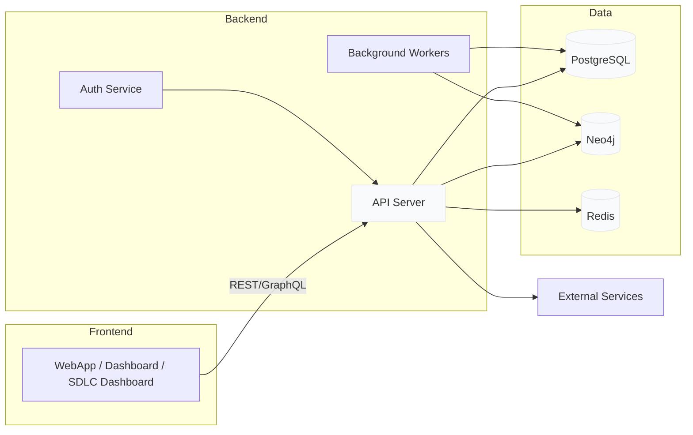

## Architecture Overview

Descripción:

- Frontend (WebApp + SDLC Dashboard) se comunica con el API central.
- El API coordina persistencia relacional (Postgres), grafos (Neo4j) y cache (Redis).
- Background workers realizan ingesta y backfilling.
