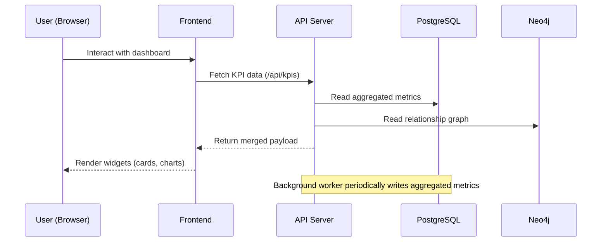

## Data Flow

```mermaid
sequenceDiagram
  participant U as User (Browser)
  participant FE as Frontend
  participant API as API Server
  participant DB as PostgreSQL
  participant G as Neo4j

  U->>FE: Interact with dashboard
  FE->>API: Fetch KPI data (/api/kpis)
  API->>DB: Read aggregated metrics
  API->>G: Read relationship graph
  API-->>FE: Return merged payload
  FE-->>U: Render widgets (cards, charts)

  Note over API,DB: Background worker periodically writes aggregated metrics
```

Descripción:

- Muestra cómo una petición de KPI se resuelve leyendo fuentes relacionales y de grafos y retornando un payload unificado.
