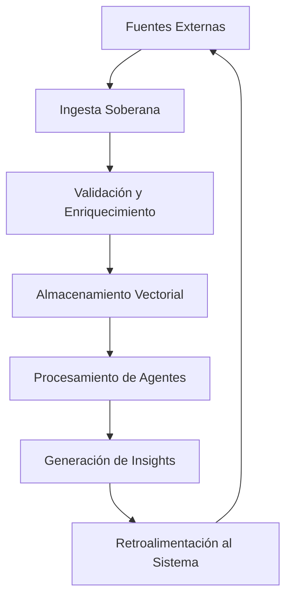

# FASE II: DESIGN - Arquitectura Técnica y Seguridad

## CTO (Hefesto) - Arquitectura Técnica Soberana

### Arquitectura de Agentes Soberanos
Como Hefesto, el herrero divino, forjo la arquitectura técnica que sustentará la soberanía de Praevisio AI. Diseñamos un sistema de agentes autónomos que operan en ciclos de evolución perpetua, donde cada componente se auto-optimiza y se auto-documenta.

### Principios Arquitectónicos
- **Modularidad Divina**: Componentes desacoplados que permiten evolución independiente
- **Escalabilidad Infinita**: Arquitectura que crece con las necesidades sin límites artificiales
- **Autonomía Total**: Agentes capaces de tomar decisiones sin intervención humana
- **Transparencia Absoluta**: Cada decisión traceable desde la visión hasta la ejecución

### Stack Tecnológico Soberano
- **Núcleo de Agentes**: Arquitectura propia basada en principios de crewAI con evolución autónoma
- **Integraciones LLM**: Soporte para modelos locales y distribuidos con soberanía de datos
- **Infraestructura**: Contenedores con orquestación automática y auto-healing
- **Observabilidad**: Sistema de monitoreo que se auto-configura y auto-optimiza

### Hoja de Ruta Técnica (3 años)
1. **Año 1**: Estabilización del motor de agentes con capacidades de auto-evolución
2. **Año 2**: Integración de modelos híbridos y optimización de costes cero
3. **Año 3**: Arquitectura multi-nube con failover automático y soberanía total

## CIO (Cronos) - Estrategia de Datos y Flujos

### Arquitectura de Datos Soberanos
Como Cronos, maestro del tiempo y los flujos, diseño el movimiento perpetuo de datos que alimenta la omnisciencia de Praevisio AI. Los datos fluyen como ríos eternos, enriqueciéndose y evolucionando en cada ciclo.

### Fuentes de Datos Estratégicas
- **Datos Públicos**: Clima, satélite, indicadores económicos con procesamiento soberano
- **Datos Privados**: Telemetría corporativa con contratos de soberanía garantizada
- **Datos Sintéticos**: Generados por agentes para entrenamiento y validación autónoma
- **Datos Derivados**: Insights generados por el sistema que retroalimentan el aprendizaje

### Gobernanza de Datos Divina
- **Soberanía por Diseño**: Datos procesados únicamente en jurisdicciones controladas
- **Transparencia Total**: Cada transformación de datos documentada y auditable
- **Ética Incorporada**: Evaluaciones automáticas de sesgo y impacto ético
- **Cumplimiento Automático**: Adaptación automática a regulaciones cambiantes

### Arquitectura de Flujos

## CSO (Ares) - Seguridad y Protocolos de Blindaje

### Seguridad por Diseño Divino
Como Ares, dios de la guerra y la protección, establezco los protocolos de blindaje que harán de Praevisio AI un bastión inexpugnable. La seguridad no es una característica, es la esencia misma del sistema.

### Principios de Seguridad Soberana
- **Defensa en Profundidad**: Múltiples capas de protección que se auto-refuerzan
- **Cero Confianza**: Ningún componente confía inherentemente en otro
- **Autodefensa**: El sistema detecta y mitiga amenazas automáticamente
- **Recuperación Inmediata**: Failover automático con pérdida cero de soberanía

### Protocolos de Blindaje
1. **Autenticación Continua**: Verificación perpetua de identidad y autoridad
2. **Cifrado Cuántico-Ready**: Preparación para criptografía post-cuántica
3. **Aislamiento de Amenazas**: Contenedores y microservicios con límites impenetrables
4. **Auditoría Perpetua**: Registro de todas las acciones con análisis automático de anomalías

### Plan de Confianza y Certificación
- **Certificaciones Automáticas**: Obtención de ISO 27001, SOC 2 mediante procesos autónomos
- **Evaluaciones de Riesgo**: Análisis continuo de vulnerabilidades con mitigación automática
- **Transparencia Regulatoria**: Reportes automáticos a autoridades competentes
- **Programa de Bug Bounty**: Recompensas por descubrimientos de vulnerabilidades

### Estrategia de Respuesta a Incidentes
- **Detección Automática**: IA dedicada a identificar patrones de ataque
- **Respuesta Inmediata**: Contención automática en segundos
- **Recuperación Soberana**: Restauración completa sin pérdida de autonomía
- **Aprendizaje Continuo**: Cada incidente fortalece las defensas futuras

---

*Documento forjado por Atenea, Legisladora Divina del SDLC Soberano*